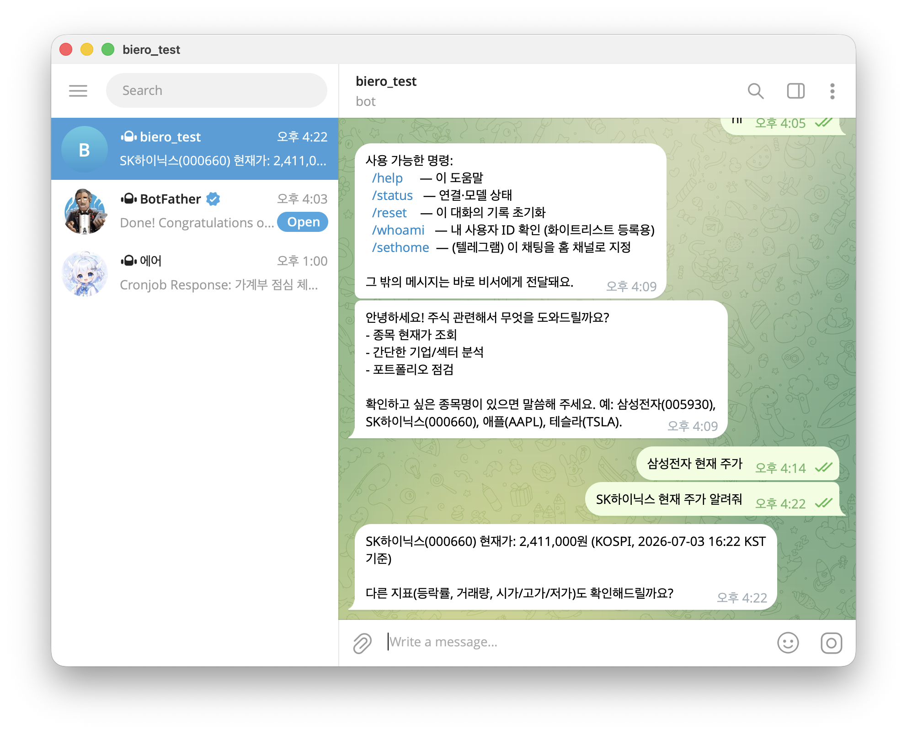
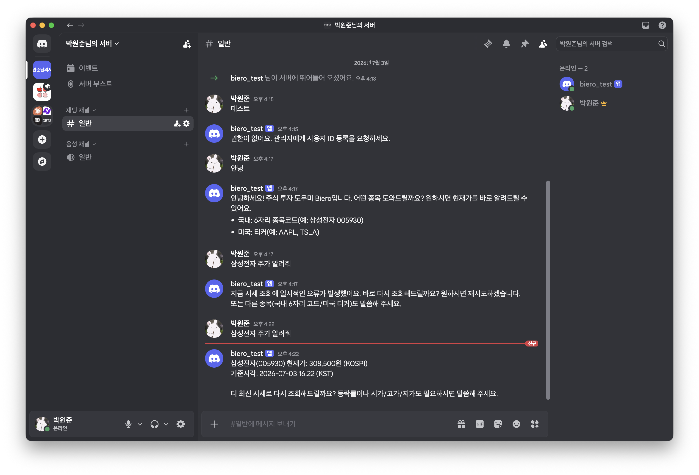

# Biero

> **B.I.E.R.O** — **B**ehavioral **I**ntelligence for **E**valuating **R**isk & **O**ptimization
>
> 리스크 평가 및 최적화를 위한 **행동 지능 비서**

**Biero**는 주식 투자를 위한 AI 비서입니다. 시장의 행동(behavior)을 읽고, 리스크를 평가하며, 포트폴리오와 의사결정을 최적화하도록 돕습니다.

터미널에서 동작하는 CLI 비서로, 어떤 LLM 공급자든 연결해 쓰고, 토스증권 Open API로 실제 시세를 조회합니다. 모든 것은 사용자 PC에서 로컬로 실행됩니다.

---

## 요구사항 (Requirements)

- **Node.js 18 이상**
- **LLM 공급자 API Key** (OpenAI · OpenRouter · Google Gemini · Groq · xAI · DeepSeek · Mistral · Anthropic · Ollama(로컬) · 직접 입력)
- **토스증권 Open API 키** — `API Key`(tsck_live_…)와 `Secret Key`(tssk_live_…)
  - 발급: 토스증권 WTS 로그인 → 설정 → Open API ([가이드](https://developers.tossinvest.com/docs))
  - 발급 화면의 **허용 IP**에 현재 PC의 공인 IP가 포함돼 있어야 합니다.

## 설치 (Install)

```bash
git clone https://github.com/my-gumi/biero
cd biero
npm install
npm link        # 전역 `biero` 명령 등록 (또는: npm install -g .)
```

## 빠른 시작 (Quickstart)

```bash
biero
```

처음 실행하면 설정 위저드가 열립니다:

1. **LLM 공급자 선택** → API Key 입력 (자동으로 연결 확인) → 모델 선택
2. **토스 API Key / Secret Key 입력** → OAuth 토큰 발급으로 자동 검증 → **계좌 목록 조회 및 기본 계좌 선택**
3. `~/.biero/config.json`에 저장 (파일 권한 `600`, 선택한 `accountSeq` 포함) → 바로 대화 시작

대화창에서 시세나 보유 종목을 물어보세요:

```text
나: 삼성전자 얼마야?
Biero: 삼성전자(005930) 현재가는 333,500원이에요. …

나: 내 보유 종목 보여줘
Biero: 선택한 계좌 기준 보유 종목과 평가손익을 정리해드릴게요. …
```

설정이 끝난 뒤에는 `biero`만 입력하면 바로 대화가 열립니다.

## 명령어 (Commands)

| 명령 | 설명 |
| --- | --- |
| `biero` | 설정돼 있으면 대화, 아니면 설정 위저드 |
| `biero chat` | AI 비서와 대화 (LLM에 바로 요청·응답, 시세 도구 사용) |
| `biero setup` | LLM 공급자 · 토스 API 키 설정 (대화형) |
| `biero gateway setup` | 텔레그램 · 디스코드 봇 토큰과 허용 사용자 설정 (대화형) |
| `biero gateway start` | 메신저 게이트웨이 상주 프로세스 시작 |
| `biero gateway status` | 게이트웨이 설정 상태 보기 |
| `biero config` | 현재 설정 보기 (키는 마스킹) |
| `biero reset` | 저장된 설정 삭제 |
| `biero --help` | 도움말 |

> 전역 등록 없이 실행하려면: `npm start` (= `node dist/bin/biero.js`).

## 메신저 원격 비서 (Gateway)

PC를 켜둔 채, **텔레그램·디스코드 봇으로 어디서든 비서에게 시세를 물어보세요.** 게이트웨이는 상주 프로세스로 떠서 메신저로 들어온 메시지를 그대로 `biero chat`과 같은 엔진(LLM + 토스 시세 도구)에 넘기고, 답을 회신합니다. 여러 메신저를 하나의 프로세스가 함께 처리합니다.

| 텔레그램 | 디스코드 |
| --- | --- |
|  |  |

### 1. 봇 만들기 (토큰 발급)

**텔레그램** — [@BotFather](https://t.me/BotFather)에게 `/newbot` → 이름·username 입력 → **Bot Token**(`숫자:영문…`)을 받습니다.

**디스코드** — [Discord Developer Portal](https://discord.com/developers/applications) → **New Application** → 왼쪽 **Bot** 탭에서:
- `Reset Token` → **Bot Token** 복사 (한 번만 보임)
- **MESSAGE CONTENT INTENT** 토글을 **ON** (안 켜면 메시지 내용을 못 읽습니다)
- **OAuth2 → URL 생성기**에서 `bot` 스코프 + `채널 보기`·`메시지 보내기`·`메시지 기록 보기` 권한으로 초대 링크를 만들어 봇을 서버에 초대

### 2. 게이트웨이 설정

```bash
biero gateway setup
```

연결할 메신저를 고르고, 각 **봇 토큰**과 **허용 사용자 ID**(쉼표로 구분)를 입력합니다. 설정은 `~/.biero/config.json`(권한 600)에 저장돼요.

> **허용 사용자(화이트리스트)** 는 원격 입력이 LLM·시세 도구를 구동하므로 유일한 방어선입니다. 비워두면 아무도 사용할 수 없고(보안 기본값), `*` 를 넣으면 전원 허용입니다.

내 사용자 ID를 모르면, 일단 봇에게 아무 메시지나 보내세요. 게이트웨이 로그에 `거부: userId=…` 로 찍히거나, 메신저에서 **`/whoami`** 로 확인할 수 있습니다. 그 ID를 화이트리스트에 넣고 다시 시작하면 됩니다.

### 3. 상주 실행

```bash
biero gateway start
```

포그라운드로 떠서 연결된 봇으로 대기합니다. 컴퓨터 백그라운드로 계속 돌리려면:

```bash
nohup biero gateway start >~/.biero/gateway.log 2>&1 &
```

종료는 `Ctrl+C`(포그라운드) 또는 프로세스 종료(백그라운드). 상태는 `biero gateway status` 로 확인합니다.

### 메신저 내 명령

| 명령 | 설명 |
| --- | --- |
| `/help` | 명령 도움말 |
| `/status` | 연결·모델 상태 |
| `/whoami` | 내 사용자 ID (화이트리스트 등록용) |
| `/reset` | 이 대화의 기록 초기화 |
| `/sethome` | (텔레그램) 이 채팅을 홈 채널로 지정 |

그 밖의 메시지는 바로 비서에게 전달됩니다. (예: `삼성전자 주가 알려줘`)

> **환경변수 오버라이드** — `TELEGRAM_BOT_TOKEN` · `TELEGRAM_ALLOWED_USERS` · `TELEGRAM_HOME_CHAT` · `DISCORD_BOT_TOKEN` · `DISCORD_ALLOWED_USERS` 가 있으면 `config.json` 값보다 우선합니다.

## 현재 구조

이번 1차 구조 개편은 기능 구현이 아니라 파일 책임과 위치만 재정리하는 작업입니다. `gateway` 영역은 최대한 유지하고, import 경로, CLI 진입점, 빌드 경로를 안전하게 정리하는 데 집중했습니다.

```text
bin/
  biero.ts

src/
  app/
    setup.ts

  runtime/
    agent.ts
    chat.ts

  llm/
    client.ts
    providers.ts

  toss/
    client.ts

  tools/
    registry.ts

  shared/
    config.ts
    theme.ts
    types.ts

  gateway/
    authz.ts
    commands.ts
    config.ts
    core.ts
    run.ts
    session.ts
    setup.ts
    platforms/
```

이번 단계의 구조 개편 원칙:

- 동작 변화 없이 파일 이동, 이름 정리, import 수정만 포함합니다.
- 이후 기능 확장에 대비해 Toss 관련 축을 먼저 보호합니다.
- `gateway`는 이번 단계에서 과하게 재구성하지 않고 안정적으로 유지합니다.
- 파일 이동과 함께 CLI 진입점, TypeScript import 경로, 빌드 경로를 함께 정리합니다.

설계 배경은 [docs/public/project-structure-design.md](docs/public/project-structure-design.md)를 참고하세요.

## 개발 (Development)

TypeScript로 작성되어 있고, `dist/`로 컴파일됩니다. (`npm install` 시 `prepare`가 자동 빌드)

```bash
npm run build      # tsc 컴파일 → dist/
npm run watch      # 변경 감지 빌드
npm run typecheck  # 타입만 검사 (no emit)
```

## 보안 (Security)

- 모든 키는 **사용자 PC(`~/.biero/config.json`, 권한 600)** 에만 저장됩니다.
- 키는 검증·사용할 때만 사용자가 고른 공급자(LLM·토스)와 **직접** 통신하며, 별도의 Biero 서버를 거치지 않습니다.

## 상태 (Status)

초기 개발 단계입니다. 현재는 **설정 → 계좌 선택 → 대화 → 시세/보유 주식 조회**, 그리고 **텔레그램·디스코드 원격 비서(게이트웨이)** 까지 동작합니다. (매수가능금액·주문 연동은 예정)
